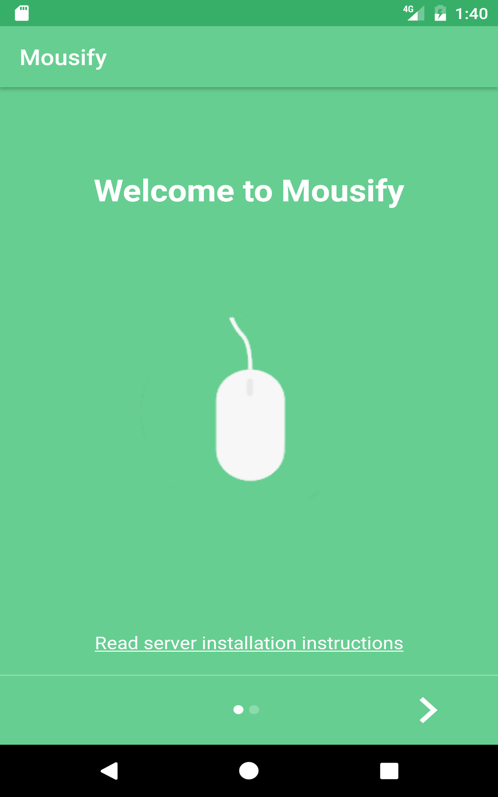
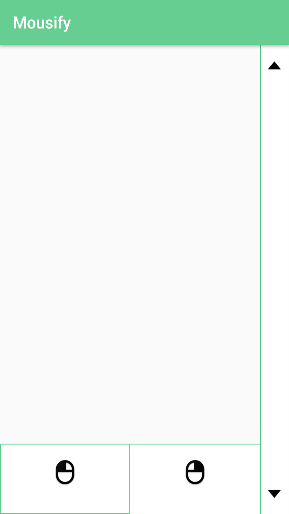

# mousify _mobile_
This app enables a user to control his PC mouse via an android phone. This repository contains **mobile side** source code.

Server side source code can be found in this [repository](https://github.com/Hazem-Ben-Khalfallah/mousify-server)

## Screenshots

## Download 
You can install Mousify app from Amazon underground app store [link](https://www.amazon.com/Hazem-Ben-Khalfallah-Mousify/dp/B01N7VK0FD)

## Server installation
Follow **Mousify _server_** installation in this  [link](https://github.com/Hazem-Ben-Khalfallah/mousify-server#requirements)

## How to use the application
1 - Open **Mousify** app in your Android phone and click on **Discover host** button or insert manually your PC IP address.
- **Discover host** functionality tries to find the host's IP address automatically. It may take some while to execute.
- **Manual Connexion** enables the user to insert host IP address directly. He should click on **Connect** button to establish connection with PC.

2 - If connection has been successful, you will be able to control your PC mouse from your phone.

## Change Logs
**0.1.0-snapshot**
- handle mouse right and left clicks
- handle text selection / double click
- handle wheel scroll

## Known issues
- Host discovery does not always work from the first try.
- Connection to PC sometimes fails

## Special Thanks
- **@johncarl81** for his **Parceler** library
- **@EsotericSoftware** for **kryonet** TCP/UDP client/server library
- **@nuuneoi** for **StatedFragment**
- **@apl-devs** for **AppIntro**
- **@medyo** for **FancyButtons**
- **@pinball83** for **Masked-Edittext**
