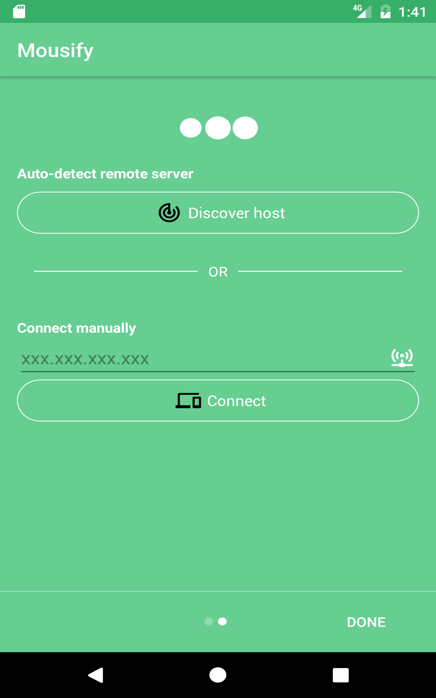

# mousify _mobile_
This app enables a user to control his PC mouse via his android phone. This repository contains **mobile side** source code.

Server side source code can be found in this [link](https://github.com/Hazem-Ben-Khalfallah/mousify-server)

## Screenshots

## How to install server
**Mousify _server_** installation is easy and can be done in five quick steps:

1 - Go to [server repository](https://github.com/Hazem-Ben-Khalfallah/mousify-server) and download latest release from [**releases**](./releases) directory

2 - Make sure you have **java 1.8** installed in your environment. If not, follow this [link](https://java.com/en/download/help/download_options.xml) to install it.

3 - Open your console where you have downloaded the jar and run

    java -jar mousify-[SOME-VERSION].jar

This will start your server and make him listen to incoming requests.

## How to use the application
1 - Open **Mousify** app in your Android phone and click on **Discover host** button or insert manually your PC IP address.
- **Discover host** functionality tries to find the host's IP address automatically. It may take some while to execute.
- **Manual Connexion** enables the user to insert host IP address directly. He should click on **Connect** button to establish connection with PC.

2 - If connection has been successful, you will be able to control your PC mouse from your phone.

## Change Logs
**0.1.0-snapshot**
- handle mouse right and left clicks
- handle text selection / double click
- handle wheel scroll

## Known issues
- Host discovery does not always work from the first try.
- Connection to PC sometimes fails